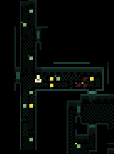

# Quasimorph Map Markers

# Description
Allows the user to add markers to the minimap.  For instance, mark the location of valuable loot to come back for later.
(Disabled by default) Can optionally add the search status dots on containers on the map.  For example, searched, empty, not searched.

## Markers
Press F2,F3, or F4 on the the main map to add a red, green, or yellow marker on the mini map.  
Press Shift + F2 to remove the marker.
In the minimap screen, right click to add or remove a red marker.
Colors and keys can be configured.

## Optional - Map Search Status
Adds a small dot to the upper right of a location that can have items on the minimap.  
Must be enabled in the settings.

* No dot means it has not been searched.
* Yellow dot means has been searched and has items.
* Grey means there are no items.

# Functionality:

Map Markers:
* Toggle add and remove markers to the minimap.
* Supports three different marker colors.
* For marked locations, shows a list of the items at that location when hovered in the minimap.

Optional Item Display:
* Can optionally add indicators if a container is empty, and the search status of corpse and floor items.
* Can optionally always show the list of containers if it has been searched before.

# Minimap markers
When in the Mini Map:
* Right click to add or remove a location under the cursor.
* Press F2 to add or remove a marker at the player's location.
* Hover a marker to list the items at that location.

When in inventory or when not in the minimap:
* Press F2,F3, or F4 to add a marker at the player's location.  Each key is a different color.  Note that this *only* adds markers to prevent accidentally removing a marker.
* Press Shift+F2 to remove the marker at the player's location.

# Location Search Status
 

Disabled by default. Adds a dot to the upper left locations of locations on the mini map.
This is great for quickly checking if an item has been searched or is already empty.  It provides the same information available in the base game.

The "search" indicator is a single dot at for each item location.  By default, no dot means the item's contents are unknown, grey means it was searched or known to be empty, yellow indicates it has been searched or known and/or to have items.

As long as a container is visible in the FoW, the empty/full status will be shown since the game shows different images based on the contents.  For instance, an empty bookshelf has no books, while one with items does.

### Notes
If a tab shows a + (new), the location will continue to be "not searched" until that tab is examined.
Toilets and sinks will have their markers one spot lower due to how the game visualizes these specific containers.

# Configuration
Common configuration options in the Mods Menu:
* Change colors.
* Change Hotkeys.
* Enable and disable the optional functionality.

## MCM
This mod supports the Mod Configuration Menu and is the preferred method for changing settings.  Use the Mods button on the main menu.

## Config File
The configuration file will be created on the first game run and can be found at `%AppData%\..\LocalLow\Magnum Scriptum Ltd\Quasimorph_ModConfigs\MapMarkers\config.json`.

### FontSize Note for MCM
Note that there is a bug in the MCM where if the user drag highlights the number, the MCM can become confused and not save the change.
Either use the slider or click on the number box and delete and re-type the value.

When using the slider, the number does not have to be perfect; there is no real difference between using 5.02 or 5.0.

## Key List
The list of valid keyboard keys can be found  at the bottom of https://docs.unity3d.com/ScriptReference/KeyCode.html
Beware that numbers 0-9 are Alpha0 - Alpha9.  Most of the other keys are as expected such as X for X.
Use "None" to not bind the key.

# Support My Mods
If you enjoy my mods and want to buy me a coffee, check out my [Ko-Fi](https://ko-fi.com/nbkredspy71915) page.
It helps motivate me to maintain as well as create mods.

Thanks!  

# Change Log
## 1.7.0
* Added status indicator.
* Added Show Explored Items option.

## 1.6.1 
* 0.9.8.2 compatibility. 

## 1.6.0
* Added additional colors

## 1.5.0
* For game version 0.9.7+ only.
* Can now remove markers when not in the minimap.  Defaults to Shift+F2.
* All keybinds can be set in the Mod Config menu.  The user no longer needs to edit the config.json directly.
* Internal: Updated Json to MCM framework to latest iteration.

## 1.4.0
* For game version 0.9.6+ only.
* 0.9.6 compatibility

## More Changes
* See the github link for older changes.

# Credits
* Special thanks to Crynano for his excellent Mod Configuration Menu. 
* [Treasure icons created by Smashicons - Flaticon](https://www.flaticon.com/free-icons/treasure)
* [Annotely](https://annotely.com/) for image annotation.

# Source Code
Source code is available on GitHub at https://github.com/NBKRedSpy/Quasimorph-Map-Markers
